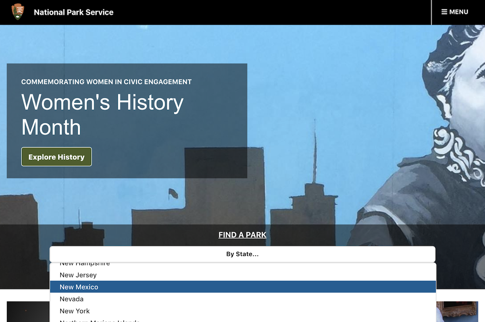
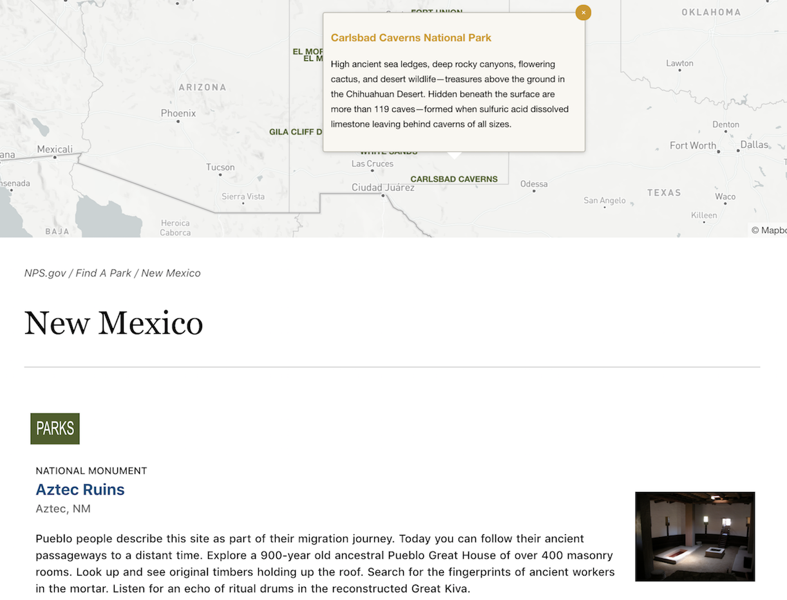

### National Park Service

#### Deployed here: [National Park Service](https://natparkservice.herokuapp.com/)

View a list of national parks, national monuments, and other natural and cultural resources by state.
Based on the official [NPS.gov](https://www.nps.gov) site's Women's History Month landing and park list pages.

<p align="center">
    
</p>
<br>
<p align="center">
    
</p>

#### Technologies Used

```
Application: React, Node.js, Express, JavaScript, HTML, CSS
Database: MongoDB
APIs: National Park Service, Mapbox
```

#### Install

```bash
# Create .env file and set value of API keys to
    NPS_API_KEY
    REACT_APP_MAPBOX_API_TOKEN

# Install dependencies for server
$ npm install

# Install dependencies for client
$ npm run client-install

# Run the client & server with concurrently
$ npm run dev

# Server runs on http://localhost:5000 and client on http://localhost:3000
```

```
Author: RunHannah
License: MIT License
```
